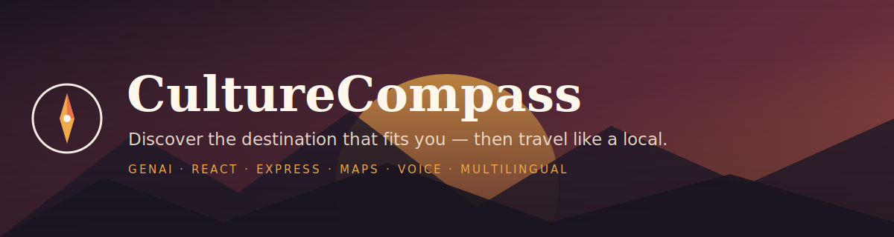

<p align="center">
  
</p>

<h1 align="center">🧭 CultureCompass</h1>

<p align="center">
  <b>A GenAI travel companion that discovers the destination that fits <i>you</i>, then turns the trip into an authentic cultural experience — with real photos, maps, immersive stories, voice, and a context-aware assistant, in your own language.</b>
</p>

<p align="center">
  <a href="LICENSE"></a>
  
  
  
  
  <a href="CONTRIBUTING.md"></a>
</p>

<p align="center">
  <a href="#-quick-start">Quick start</a> ·
  <a href="#-features">Features</a> ·
  <a href="#-tech-stack">Tech stack</a> ·
  <a href="#-configuration">Configuration</a> ·
  <a href="#-roadmap">Roadmap</a> ·
  <a href="CONTRIBUTING.md">Contributing</a>
</p>

---

## ✨ What is CultureCompass?

Most travel apps assume you already know where to go and hand you a generic top-10 list. CultureCompass starts one step earlier — **"which destination even fits me?"** — and goes one step deeper — **"connect me with the living culture, not just the monuments."**

1. 🧭 **Learns your vibe** — a short, friendly form (with voice input).
2. 🌍 **Discovers destinations** — an AI persona + fitted destinations with reasoning.
3. 🎫 **Builds a Cultural Passport** — attractions, hidden gems, immersive story, heritage, food, events, and an authentic hands-on experience — enriched with **real photos, an interactive map, and live weather**.
4. 💬 **Atlas companion** — a context-aware assistant on every page, in your language.

> 🔗 **Live demo:** https://culture-compass-rhiu.onrender.com

---

## 📸 Screenshots

> _Add screenshots/GIFs to `docs/screenshots/` and they'll appear here._

<!--
| Discovery | Cultural Passport | Atlas companion |
|---|---|---|
|  |  |  |
-->

---

## 🚀 Quick start

```bash
git clone https://github.com/vijays376/culturecompass.git
cd culturecompass
npm install
cp .env.example .env      # add at least one LLM key (Groq is free + fast)
npm run dev               # API on :3000, Vite client on :5173
```

Open **http://localhost:5173**. No image keys required — photos work out of the box.

```bash
npm test        # backend test suite (node:test)
npm run build   # build the client
npm start       # production: Express serves the built client + API on one port
```

---

## 🧩 Features

**Discovery & personalization**
- 🧭 AI-inferred **traveller persona** + 3 fitted destinations with "why this fits you"
- 🌐 **Multilingual** generation — the whole experience in the traveller's language
- 🎙️ **Voice input** (dictation) on the interests field and in chat

**The Cultural Passport**
- 📍 6 personalized attractions · 💎 2 hidden gems · 🎨 an authentic local experience
- 🖼️ **Photo galleries** per place with a full-screen carousel (keyboard + counter)
- 🗺️ **Interactive map** with pins linked to cards ("show on map")
- 🌡️ Live **weather**, 📚 factual overview, 🍛 food, 🎉 events, 🗣️ phrases, 🙏 etiquette
- 🔊 **Listen to the whole passport** (text-to-speech)
- ✉️ A ready-to-send intro message **in the local language** (+ its meaning)

**Atlas — the companion**
- 💬 Context-aware on every page: explains the app (home) → helps you choose (discover) → destination expert (passport)
- 🎧 Voice dictation + suggestion chips

**Engineering**
- 🔁 **Multi-provider failover** for both LLMs and images (never hard-fails)
- ⏱️ Per-request timeouts, input clamping, security headers, curated fallbacks
- ♿ Accessibility-first (semantic HTML, focus management, reduced-motion, ARIA)

---

## 🏗️ Tech stack

| Layer | Tech |
|-------|------|
| Frontend | React 18, React Router, Vite, plain CSS (Sunset Terracotta theme), Leaflet |
| Backend | Node.js (≥18), Express |
| AI | OpenAI-compatible chat APIs with failover: **Groq → NVIDIA → Gemini → OpenRouter** |
| Images | Provider chain: **Pixabay / Pexels / Unsplash → Openverse → Wikimedia** (keyless works) |
| Maps / geo | Leaflet + OpenStreetMap · geocoding via Photon + Nominatim |
| Enrichment | Wikipedia (overview) · Open-Meteo (weather) |
| Voice | Web Speech API — SpeechSynthesis (TTS) + SpeechRecognition (mic) |

See **[ARCHITECTURE.md](ARCHITECTURE.md)** for the diagram and **[HANDOFF.md](HANDOFF.md)** for API contracts.

---

## ⚙️ Configuration

Copy `.env.example` to `.env` and set what you need.

**LLM providers** (failover order `groq → nvidia → gemini → openrouter`):
`PROVIDER`, `API_KEY`, `MODEL`, and per-provider `GROQ_API_KEY` / `NVIDIA_API_KEY` / `GEMINI_API_KEY` / `OPENROUTER_API_KEY` (+ optional `*_MODEL`).

**Image providers** (all optional — keyless sources always work):
`PIXABAY_KEY`, `PEXELS_KEY`, `UNSPLASH_ACCESS_KEY`. Each is used within its free-tier rate limit, with in-memory caching to stay well under quota.

**Behavior:** `TEMPERATURE`, `LLM_TIMEOUT_MS`, `PORT`, `DEBUG`, `CC_NO_ENRICH`.

### Failover, in one line
If a provider is rate-limited, times out, or returns malformed output, the next is tried automatically; if all fail, the app serves curated demo content with a user-facing notice — so a live demo never breaks.

---

## 🧪 Tests

```bash
npm test
```
Covers JSON extraction, prompt builders, language rules, fallback shapes, the provider registry, input clamping, and HTTP integration across all endpoints — using the offline fallback path, so it's fast and network-free.

---

## ☁️ Deployment (Render)

- **Build command:** `npm run build`
- **Start command:** `npm start`
- Add your provider keys as environment variables (the `.env` file is not deployed).

---

## 🗺️ Roadmap

- [ ] Real-time local events via a tourism/events API
- [ ] Save & share a Cultural Passport (PDF + link)
- [ ] AI Vision — identify a monument or dish from a photo
- [ ] "Most-liked" image ranking when premium image keys are present
- [ ] Offline / PWA mode for on-trip use
- [ ] User accounts + saved trips
- [ ] Community-contributed hidden gems

Have an idea? [Open an issue](https://github.com/vijays376/culturecompass/issues) 🙌

---

## 🤝 Contributing

Contributions are welcome! Please read **[CONTRIBUTING.md](CONTRIBUTING.md)** to get started. Good first areas: new languages, image providers, accessibility, and tests.

## 📄 License

Released under the **[MIT License](LICENSE)**.

## 🙏 Acknowledgements

Built on wonderful free/open services: OpenStreetMap · Photon · Nominatim · Wikipedia · Open-Meteo · Openverse · Wikimedia Commons — and OpenAI-compatible LLM providers (Groq, NVIDIA, Google Gemini, OpenRouter).
